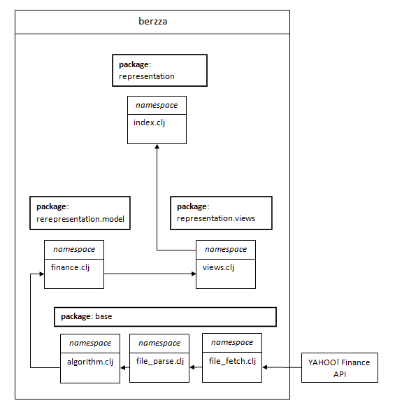
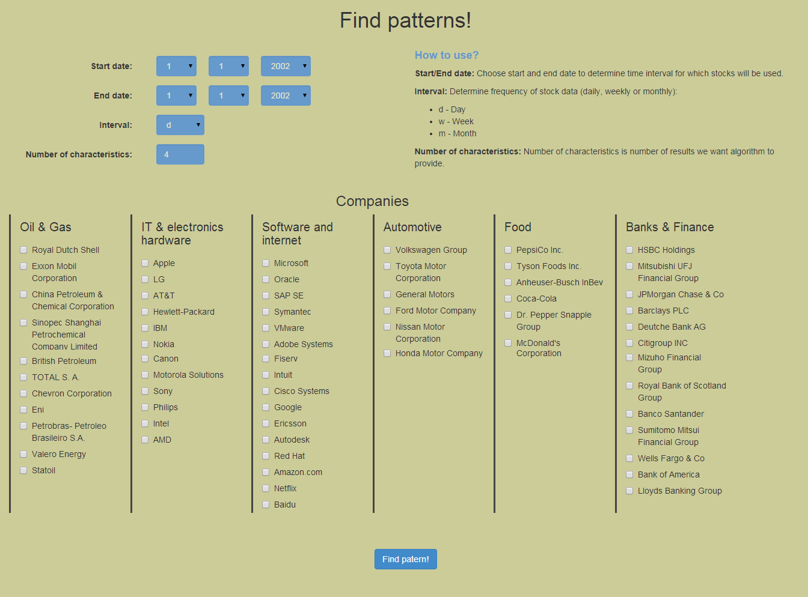
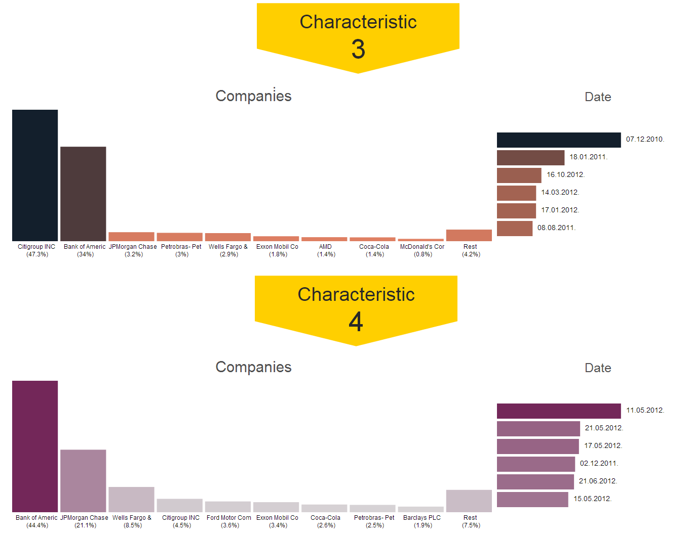

berzza
======

# 1. Requirements

The idea behind this project is to provide functonality of factorizing stock data and finding patterns in them.

Program workflow consists of several phases:

1. User submits parameters (time period, number of features and companies)
2. Program collects this data for multiple companies, for a provided period of time
2. Data is parsed, prepared (forming a matrix of data)
3. Program uses Non-negative Matrix Factorization (NMF), with user-provided parameters to extract features.
4. Visualised result is shown to user.
 
# 2. **NMF** - Non-negative matrix factorization

NMF is method for factorizing start matrix (V) in (usually) two matrices, W and H. All three matrices have non-negative elements. Matrix multiplication of W and H should be equal to V. -> **V ≈ W x H**

Algorithm is iterative and stops when WxH is equal to V or after some stopping criteria (ex. difference is small enough). Result of algorithm are matrices W and H.

More information in [1].

Solution: Data is collected from [YAHOO! Finance API](http://finance.yahoo.com). This api provides stock trade data for every company (that trades on NYSE - New York Stock Exchange), for a each trade day. Property used for calculations in this project is Volume of traded stocks for day.

# 3. Techical realisation

The application is written in [Clojure](http://clojure.org/). Clojure is functional programming language, dialect of Lisp, that executes on JVM. In application, several Clojure libraries were used:

[Incanter](https://github.com/incanter/incanter/) is statistical and mathematical computing library. It is used here mostly for matematical purposes (matrix operations, etc).

[Ring](https://github.com/ring-clojure/ring) is web applications library, used for abstracting details of HTTP.

[Compojure](https://github.com/weavejester/compojure) is small routing library for Ring.

[Hiccup](https://github.com/weavejester/hiccup) is library for HTML templating, via Clojure-like syntax.

**Project structure**

Picture 2 - Structure

###Visualization:

[D3.js](http://d3js.org/) is visualisation library written in javascript. It is very powerful with svg.

# 4. Use example

After the launching the project and clicking on *Find patterns!*, input form is shown:

Picture 2 - Input form

Here, we have to choose *Start date*, *End date*, *Interval* and *Number of features*. Then, we select companies whose trading stocks we want to explore. Interval can be:

* *d* - Day
* *w* - Week
* *m* - Month

In this example, we chose following parameters:

* **Start date** - April 10th, 2007.
* **End date** - October 16th, 2012.
* **Interval** - d (Days)
* **Number of features** - 7
* **Companies:**
  * *Oil and gas:* Exxon Mobil, Sinopec Shangai, British Petroleum, Petrobras
  * *It and electronics:* LG, Canon, Philips, Intel, AMD
  * *Automotive:* Volkswagen, Toyota, General Motors, Ford Motor
  * *Food:* PepsiCo, Coca-cola, McDonald's
  * *Banks and finance:* HSBC Holdings, JPMorgan Chase, Barclays, Deutche Bank, Citigroup, Wells Fargo, Bank of America

#####Now, we shall interpret some of features we got!

Picture 3 - Input form - example

   
##Results:

Picture 4 - Feature 0-1

####Feature 0:

On March 13th, 2012. Federal Reserve announced annual report in which, Bank of America passed, so-called “stress-test”. After that, price of their stocks started increasing (that’s why March 16th is important), and on March 19th, stock topped $10, first time after August 2011.

Picture 3 - Feature 2-3

####Feature 2:

*Eventually by December 2010, Citigroup repaid the emergency aid in full and the US government received an additional $12 billion profit in selling its shares* - Wikipedia.

Citigroup and Bank of America were both heavily supported by US Government in period after beginning of economic crisis (in 2009), by reducing its share - in Citigroup for $21 billion and in Bank of America $21 billion. Recovery of Citigroup obviously boosted trust in Bank of America.

###Feature 3

On 10. May 2012. JPMorgan disclosed significant loss of $2 billion since start of April. After that, they even started internal investigation.

After the crisis, JP Morgan Chase emerged as greatest USA bank. Seems that this report shook all financial sector, because, as we can see, this feature is significant for Bank of America, JP Morgan Chase, Wells and Fargo and Citigroup.

Picture 5 - Feature 4-5

Picture 6 - Feature 6

####Feature 6

Ford motors posted on 28. January 2011. its  greatest annual income since 1999.
General Motors launched largest U.S. Initial public offering of 2010 on NYSE (and one of the largest in history).

# 5. Acknowledgements
This application has been developed as a part of the project assignment for the subject [Intelligent Systems](http://is.fon.rs) at the [Faculty of Organization Sciences](http://fon.rs/), University of Belgrade, Serbia.

# 6. References

[1] Hoyer, P. O. (2004). Non-negative matrix factorization with sparseness constraints. The Journal of Machine Learning Research, 5, 1457-1469.
